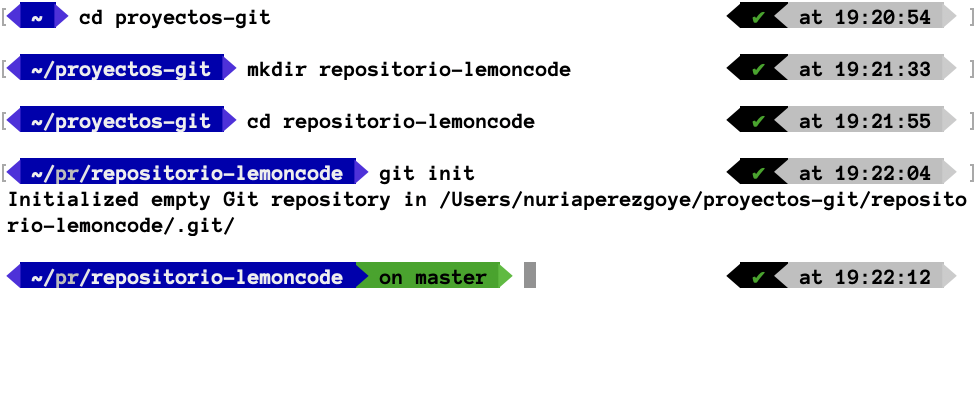
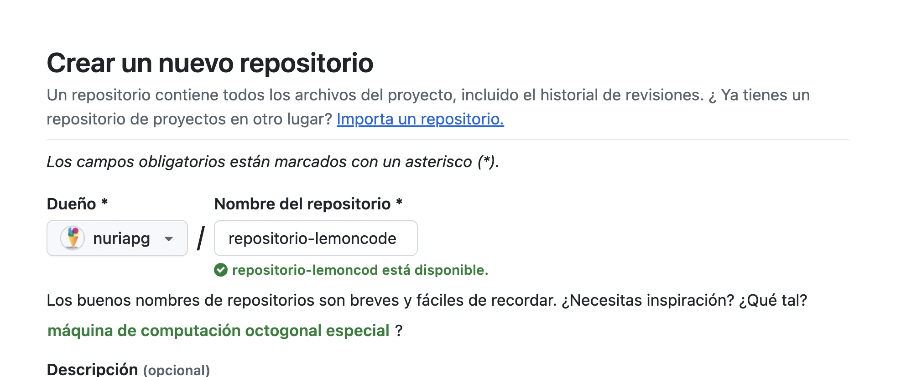
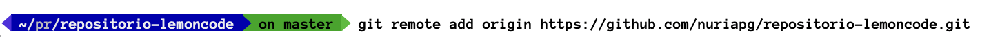
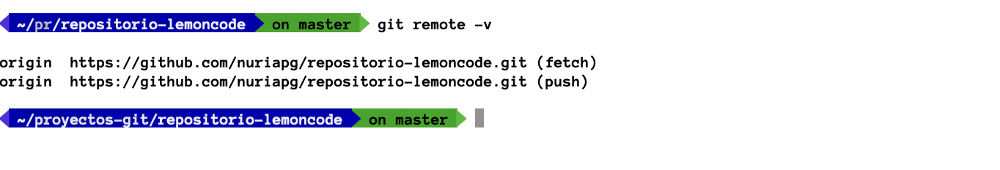
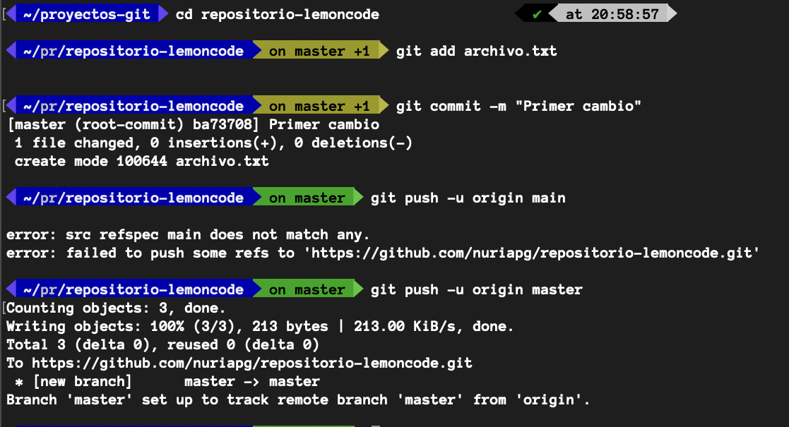
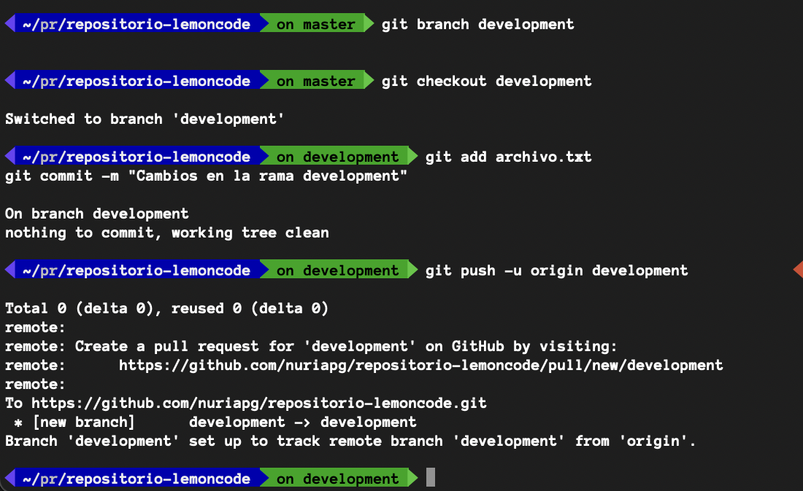
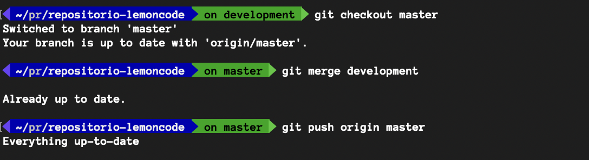

# Laboratorio de Git

Este laboratorio tiene como objetivo practicar los comandos básicos de Git.

## Pasos realizados

1. **Inicialización del repositorio local**: Se creó un repositorio local en la carpeta deseada.
2. **Subida a GitHub**: El repositorio local se conectó con GitHub.
3. **Commit y push**: Se realizaron cambios en el archivo y se subieron a GitHub.
4. **Creación de una rama**: Se creó y trabajó en una rama "development".
5. **Merge a master**: Se fusionó la rama "development" con la rama "master".

### Capturas de pantalla
- Se incluyeron capturas de pantalla que muestran los pasos seguidos durante el laboratorio.
     

